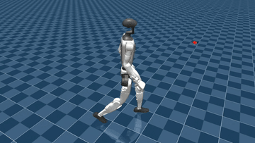
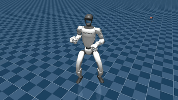
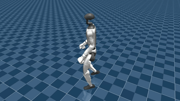
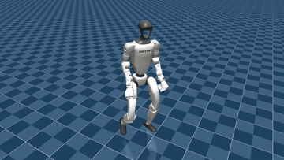

# sonic-results

在 MuJoCo 中零样本部署 NVIDIA SONIC，让它在 Unitree G1 上跟踪三段 LAFAN1 动作，并与 BeyondMimic 逐段训练的专家策略使用同一份参考数据，作为通用模型与专家模型的对比基线。代码整理后上传。

## 效果

MuJoCo 录屏，每段截取 6 秒。

| 走路 | 搏击 |
|---|---|
|  |  |

| 冲刺，完成第二段圆弧 | 冲刺，第二段圆弧失稳 |
|---|---|
|  |  |

走路与搏击均稳定完成（搏击十余回合零摔倒）；冲刺约 1/3 的回合在第二段高速转弯处失稳，说明零样本下的主要短板是高速转向，而非上肢大幅动作。

动作片段：`walk1_subject1` 122–722、`fightAndSports1_subject1` 1558–2158、`sprint1_subject2` 1727–2327（LAFAN1 30 fps 原始帧号），各 20 s，重采样至 50 Hz。

## 流程

```
BeyondMimic motion.npz
  → 格式转换（30 → 14 个跟踪身体，IsaacLab → MuJoCo 关节顺序）+ 逐帧 FK 校验
  → SONIC C++ 部署（TensorRT，Docker）⇄ MuJoCo 仿真（DDS）
  → ZMQ 逐帧状态采集 → 误差分析
```

## 要点

- **部署**：官方容器 CUDA 12.4.1 升至 12.8.1 以支持 RTX 5070 Ti（`sm_120`），TensorRT 固定 10.13。
- **数据校验**：转换前逐帧做正运动学校验，三段动作误差均为 0.00 mm；打乱关节顺序的反向对照误差 539–898 mm，证明校验有效。
- **模型差异**：发现官方部署用的 MuJoCo 模型与训练 URDF 腰部相差约 1 cm（躯干 FK 偏差 10 mm），跨方法 sim2sim 对比需统一机器人模型。
- **逐帧采集**：官方订阅器使用 `CONFLATE` 会丢帧，自写采集程序以消息序号校验完整性，实测 50 Hz、零丢帧；以目标关节角匹配参考动作反推帧号（残差 1e-7 rad，错配动作约 2 rad），并借此发现一次录错动作。
- **误差（搏击，单回合）**：每关节平均误差 8.2°，最大项为肩部 yaw 与腕部；跟踪滞后约 1 帧（20 ms）。
- **结果不确定性**：仿真与控制进程不锁步，状态延迟在 0.9–5.4 ms 间波动，同一动作每次结果不同，评估需多回合统计。

## 环境

| | |
|---|---|
| GPU | RTX 5070 Ti（Blackwell，`sm_120`） |
| 部署容器 | 官方 Dockerfile，CUDA 12.8.1 |
| TensorRT | 10.13.0 |
| SONIC | commit `b042411`，Hugging Face `nvidia/GEAR-SONIC` 默认权重 |

## 相关项目

[SONIC / GR00T-WholeBodyControl](https://github.com/NVlabs/GR00T-WholeBodyControl)、[BeyondMimic](https://github.com/HybridRobotics/whole_body_tracking)、[MuJoCo](https://github.com/google-deepmind/mujoco)、[TensorRT](https://developer.nvidia.com/tensorrt)

## 数据与许可

动作数据来自 Ubisoft [LAFAN1](https://github.com/ubisoft/ubisoft-laforge-animation-dataset)（CC BY-NC-ND 4.0），转换后的数据不在此分发。SONIC 权重遵循 NVIDIA Open Model License，请从官方仓库获取。
